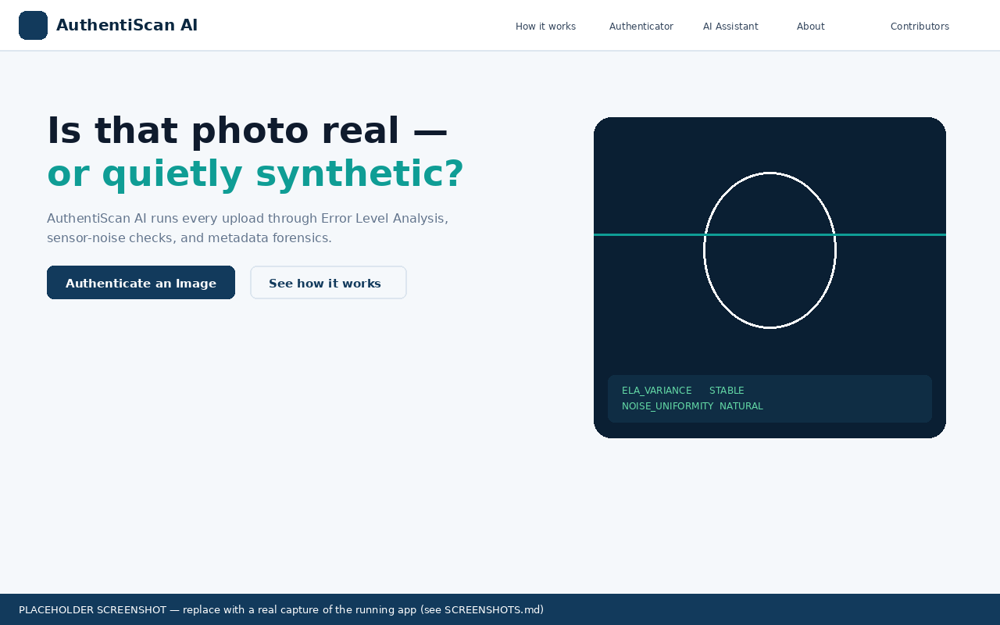
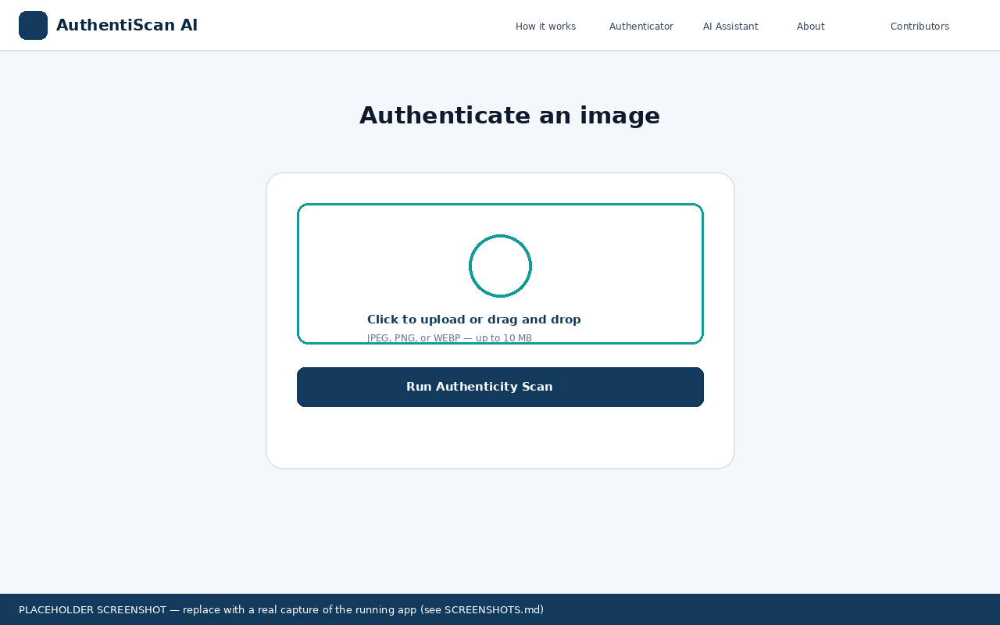
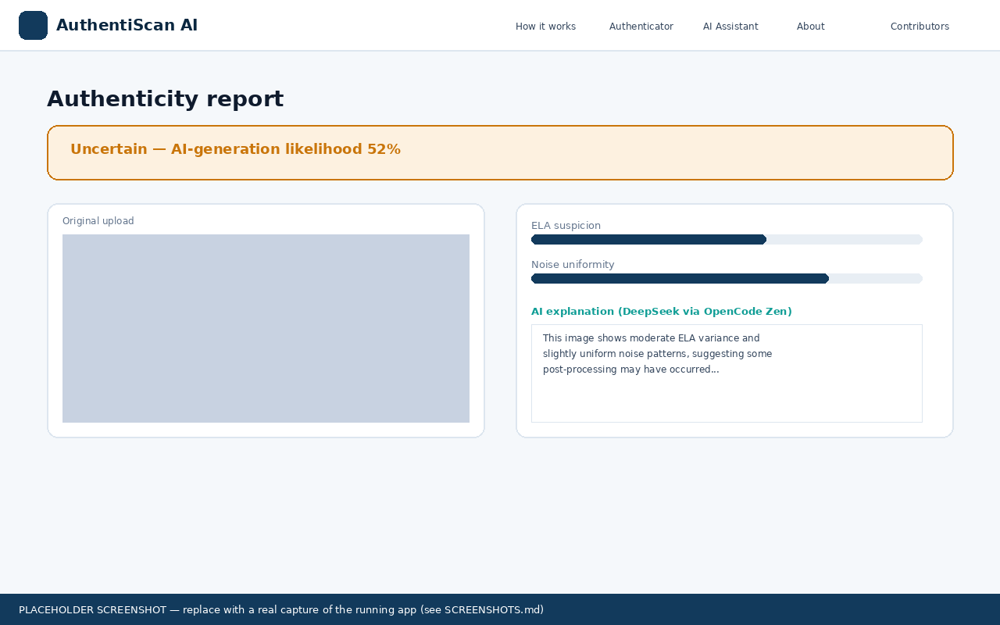
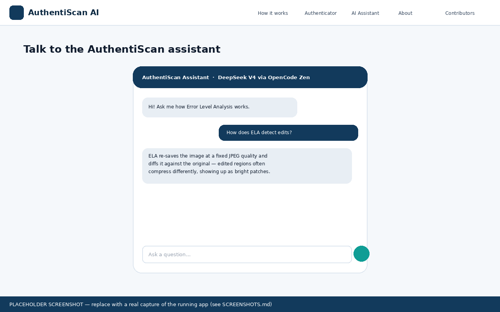
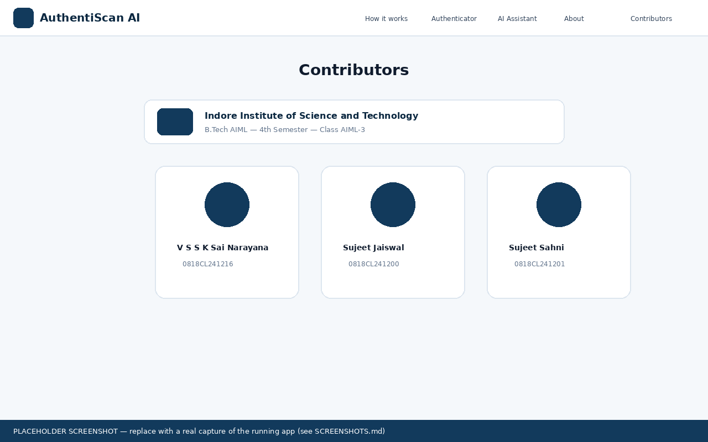

# AuthentiScan AI — Proof-of-Human Image Authenticator

A full-stack Django web app that flags likely **AI-generated or manipulated images**
using classical, explainable image-forensics techniques — **Error Level Analysis (ELA)**,
**sensor-noise consistency analysis**, and **EXIF metadata forensics** — combined into a
single "AI-generation likelihood" score. A DeepSeek model (served via **OpenCode Zen**)
then explains each result in plain English and powers an interactive chat assistant.

Built as a **B.Tech AIML, 4th Semester (Class AIML-3)** academic project at the
**Indore Institute of Science and Technology**.

> 📄 See also: [`ARCHITECTURE.md`](ARCHITECTURE.md) for the technical design, and
> [`FLOW.md`](FLOW.md) for the end-to-end request/data flow.

---

## ✨ Features

- **Light-themed, animated, responsive UI** — sticky navbar, scroll-reveal animations,
  a signature animated "scan-line" hero visual, [Lucide](https://lucide.dev) icons throughout.
- **Landing page** explaining the concept, methodology, and flow.
- **Image authenticator**: drag-and-drop upload → ELA heatmap → weighted suspicion
  scores → verdict banner (Likely Authentic / Inconclusive / Likely AI-Generated).
- **LLM explanation layer**: DeepSeek (via OpenCode Zen, free tier) turns the raw
  numeric scores into a short, honest, plain-English explanation.
- **Interactive AI chat assistant**: ask general questions about image forensics, or
  discuss a specific scan result (the assistant is given that scan's scores as context).
- **Scan history** page and Django admin for reviewing past scans.
- **Contributors page** with the team's names, enrollment numbers, and institute branding.
- **Fully environment-driven LLM config** — change the provider, base URL, model, or
  API key by editing **only** the `.env` file. No code changes required.

---

## 🖼️ Screenshots

> The images below are **layout placeholders** generated to match the app's real design
> tokens (colors, type, spacing) — they illustrate structure, not pixel-perfect output.
> Run the app locally and replace them with real captures before final submission.
> See [`docs/SCREENSHOTS.md`](docs/SCREENSHOTS.md) for exactly how to do this in under
> five minutes.

| | |
|---|---|
| **Landing page**  | **Upload / authenticator**  |
| **Scan result**  | **AI chat assistant**  |
| **Contributors**  | |

---

## 🧱 Tech Stack

| Layer | Technology |
|---|---|
| Backend | Django 5/6, SQLite (zero-config) |
| Image forensics | Pillow, NumPy (Error Level Analysis, noise analysis, EXIF parsing) |
| LLM | DeepSeek (`deepseek-v4-flash-free`) via **OpenCode Zen** OpenAI-compatible API |
| Frontend | Server-rendered Django templates, vanilla JS (IntersectionObserver scroll-reveal), custom CSS design system |
| Icons | [Lucide](https://lucide.dev) (via CDN) |
| Fonts | Space Grotesk (display), Inter (body), JetBrains Mono (data/scores) |

No React/Node build step is required — everything runs from Django's own static file
handling, which keeps the submission simple to run and grade.

---

## 🚀 Getting Started

### 1. Prerequisites
- Python 3.11+
- pip

### 2. Clone / extract and set up a virtual environment

```bash
cd authentiscan
python3 -m venv venv
source venv/bin/activate        # Windows: venv\Scripts\activate
pip install -r requirements.txt
```

### 3. Configure your environment

```bash
cp .env.example .env
```

Open `.env` and set your **OpenCode Zen** API key:

```env
OPENCODE_API_KEY=your_opencode_zen_api_key_here
OPENCODE_BASE_URL=https://opencode.ai/zen/v1
OPENCODE_MODEL=deepseek-v4-flash-free
```

Get a free API key at **https://opencode.ai/auth** (OpenCode Zen dashboard) — the
`deepseek-v4-flash-free` model has a free tier with no credit card required.

> The app still works fully without a key — forensic scans, scores, and the ELA
> heatmap are all computed locally regardless. Only the natural-language explanation
> and chat assistant require the LLM key, and they fail gracefully with a clear
> message if it's missing.

### 4. Run migrations and start the server

```bash
python manage.py migrate
python manage.py runserver
```

Visit **http://127.0.0.1:8000/** in your browser.

### 5. (Optional) Create an admin account

```bash
python manage.py createsuperuser
```

Then visit `/admin/` to review scans and chat sessions directly.

---

## 📖 How to Use

1. **Home** (`/`) — read the pitch and methodology overview, then click **Authenticate an Image**.
2. **Authenticator** (`/scan/`) — drag and drop (or click to browse) a JPEG/PNG/WEBP image
   (max 10 MB) and click **Run Authenticity Scan**.
3. **Result** (`/scan/result/<id>/`) — view:
   - The verdict banner (Likely Authentic / Inconclusive / Likely AI-Generated)
   - The original image next to its ELA heatmap
   - The three underlying suspicion scores (ELA, noise, metadata)
   - A DeepSeek-generated plain-English explanation
   - Raw EXIF/metadata details (expandable)
4. Click **Discuss this result** to open the **AI Assistant** (`/assistant/?scan=<id>`)
   pre-loaded with that scan's context, or visit `/assistant/` directly for general
   questions about image forensics and AI-detection.
5. **History** (`/scan/history/`) — browse all past scans on this server.
6. **Contributors** (`/contributors/`) — the project team and institute details.

---

## 📂 Project Structure

```
authentiscan/
├── config/            # Django project settings, root URLs
├── core/               # Landing, About/methodology, Contributors pages
├── detector/           # Image upload, ELA/noise/metadata forensics engine, results
├── chatbot/            # Chat sessions/messages, AJAX assistant endpoint
├── common/llm.py       # Shared OpenCode Zen / DeepSeek API client
├── templates/          # All HTML templates (base + per-app)
├── static/             # CSS design system, JS (scroll-reveal, chat, upload dropzone)
├── docs/               # Architecture, flow, and screenshots documentation
├── media/              # Uploaded images + generated ELA heatmaps (runtime)
├── .env.example        # Copy to .env and fill in your OpenCode Zen API key
└── requirements.txt
```

---

## 🔐 Notes on the LLM Integration

- The app talks to OpenCode Zen's **OpenAI-compatible** `/chat/completions` endpoint
  at `https://opencode.ai/zen/v1`, authenticated with a bearer API key.
- Both the **explanation generator** (`detector/views.py`) and the **chat assistant**
  (`chatbot/views.py`) go through the single shared client in `common/llm.py` — so
  swapping models/providers is always a one-file (`.env`) change.
- Failures (missing key, network errors, rate limits) are caught and surfaced as a
  clear, non-crashing message in the UI — the forensic scan itself never depends on
  the LLM being available.

---

## 👥 Team

| Name | Enrollment No. |
|---|---|
| **V S S K Sai Narayana** (Team Lead) | 0818CL241216 |
| Sujeet Jaiswal | 0818CL241200 |
| Sujeet Sahni | 0818CL241201 |

**Indore Institute of Science and Technology** — B.Tech AIML, 4th Semester, Class AIML-3

---

## ⚠️ Disclaimer

This is an academic project demonstrating a **heuristic, explainable forensic
pipeline** — it is not a trained deep-learning classifier and not a forensic-grade
or legal determination of image authenticity. Treat its output as a first-pass
triage signal, not a final verdict.
